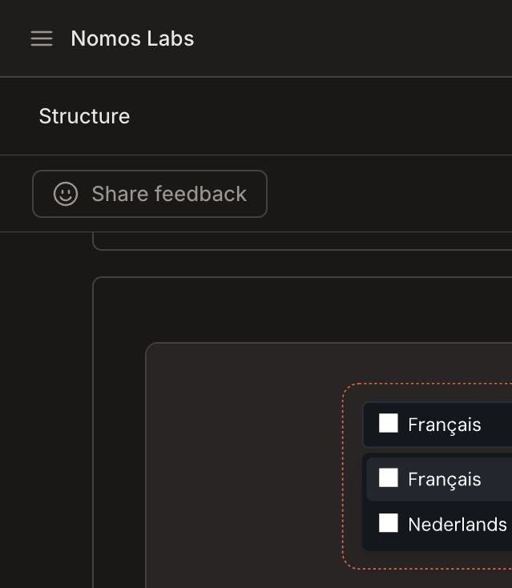

# Free-plan implementation specification

TASK_ID=SG-DOCS-003

## Verified current state

Evidence was collected in the signed-in GitBook site UI on 2026-07-22.

- The site Plan screen says **Ultimate site downgraded to Basic**.
- Site structure shows **Sections** with an **Upgrade to Ultimate** control; Sections are unavailable.
- Site structure shows an active **Add variant** control. Its dialog accepts a Space and title and says variants begin as drafts. No variant was created, so end-to-end language switching is not yet claimed.
- One Home Space is connected to the site.
- Basic customization visibly supports Clean/Muted themes, primary/tint color, mode toggle, corner/depth/link style, and sidebar styles.
- Logo, semantic colors, code theme, custom fonts/icons, Bold/Gradient themes are marked Premium.
- Site navigation, Preview, Change requests, built-in site search, Git Sync source, and the public site are visible.

Additional evidence:

- [Current Basic public site](screenshots/current-basic-public-home.png)
- [Git Sync pinned to the unchanged base branch](screenshots/git-sync-pinned-branch.png)
- [Five-service local proposal](screenshots/local-proposal-home-desktop.png)
- [API Reference local proposal](screenshots/local-proposal-api-reference.png)
- [Traditional Chinese mobile local proposal](screenshots/local-proposal-mobile-zh-tw.png)

The three local-proposal images are not represented as GitBook-rendered screenshots. The actual Git Sync configuration remains pinned to docs/doc-sg-001-api-docs; changing it and saving would start a sync. Because GitBook mutation/publication is not authorized, the redesigned branch cannot be truthfully captured in the hosted renderer in this round.

## Free-plan implementation

The branch source uses one site and one Space. Since five native Sections are unavailable, the journey is reproduced with Home landing links, a compact SUMMARY grouped into Documentation, API Reference, Changelog, Help Center, and Language, plus five service pages.

## API Reference grouping

Only six first-release endpoint contracts appear across five approved service families. Candidate pages say not deployed; current routes retain their native vocabulary and response shape.

## Changelog and Help Center

Changelog accepts external integration changes only. Help Center routes by auth, environment status, decisions, x402 billing, errors, troubleshooting, and safe support handling.

## Search

Built-in site search is visible. A one-Space site cannot provide true per-Section search scopes, so titles lead with service names and pages state candidate/current authority.

## Language and URLs

English is primary beneath the existing site URL. Source paths remain en/ and a linked zh-TW landing. A Variant is visible in the UI but will not be used until Space, URL, indexing, canonical, hreflang, search, and publication behavior are verified without upgrade.

## Maintenance

Edit on a docs branch, validate, update Draft PR, inspect GitBook Change Request/Preview, obtain PM/QA/security/Founder approval, then merge/publish only with separate authorization.

## Future upgrade path

If Ultimate is later approved, map Documentation, API Reference, Changelog, and Help Center to native Sections without changing stable page slugs.

## Visual QA results

- Desktop Home: five service cards present, service cards precede deep concepts.
- Desktop API Reference: complete endpoint-page proposal remains sample-only.
- Mobile zh-TW at 390 by 844: document scrollWidth 375 equals clientWidth 375; no horizontal overflow.
- Traditional Chinese headline preserved as two intentional lines without word splitting.
- Critical dark-theme contrast ratios: primary text 18.40:1, secondary text 10.38:1, tertiary text 7.50:1, primary button 9.35:1, accent 13.42:1, warning 12.86:1. All exceed WCAG AA for their tested uses.
